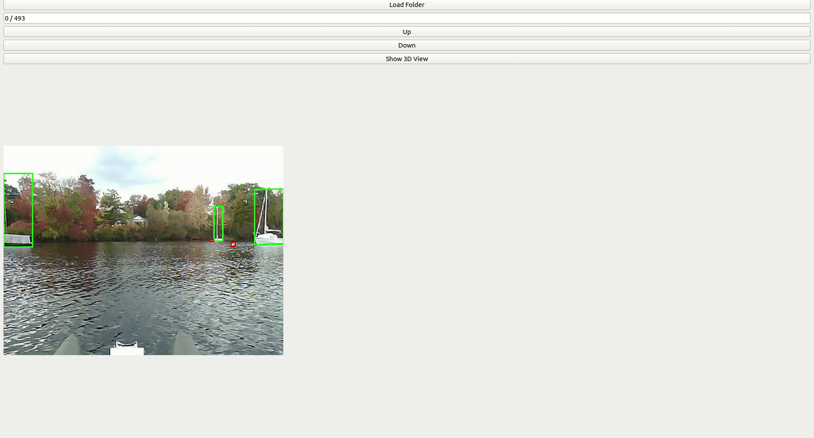

# SeePerSea
Welcome to the SeePerSea Dataset from the Dartmouth Reality and Robotics Lab!
Our paper is currently under review for IEEE Transaction on Field Robotics (T-FR)!

__our dataset website__:  https://seepersea.github.io/

This paper introduces the first publicly accessible labeled multi-modal perception dataset 
for autonomous maritime navigation, focusing on in-water obstacles within the aquatic environment to enhance situational awareness for Autonomous Surface Vehicles (ASVs). This dataset, collected over 4 years and consisting of diverse objects encountered under varying environmental conditions, aims to bridge the research gap in ASVs by providing a multi-modal, annotated, and ego-centric perception dataset, for object detection and classification. We also show the applicability of the proposed dataset by training deep learning-based open-source perception algorithms that have shown success in the autonomous ground vehicle domain. We expect that our dataset will contribute to the development of future marine autonomy pipelines and marine (field) robotics.

## Authors
Jeong, Mingi* and Chadda, Arihant* and Ren, Ziang and Zhao, Luyang and Liu, Haowen and Roznere, 
Monika and Zhang, Aiwei and Jiang, Yitao and Achong, Sabriel and Lensgraf, Samuel and Alberto Quattrini Li

\* these authors equally contributed.

## Maintainer
* Mingi Jeong: mingi.jeong.gr@dartmouth.edu
* Arihant Chadda: ari.chadda@gmail.com

## Contribution
* SeePerSea, the first LiDAR-camera dataset in aquatic environments with object labels across two modalities, will foster the development of robust fusion perception pipelines for ASV autonomy.
* SeePerSea, covering various environments and day conditions, will help ensure that developed perception pipelines are increasingly generalizable.

## Dependencies
The following environment is tested for the GUI viewer for the sample dataset.
* Ubuntu >= 20.04 (tested environment)
* PyQt5 5.14.1
* Open3D 0.13.0
* Numpy 1.24.4
* openCV-python 4.10.0.84
* python 3.8.10

## Folder Explanation
* __camera_label__ (.json): object labels based on camera ( [AnyLabeling](https://github.com/vietanhdev/anylabeling)
) -- 6 digit file name per frame number 
* __annotations__ (.json): object labels based on LiDAR ( [3d-bat](https://github.com/walzimmer/3d-bat)
) -- 6 digit file name per frame number
* __calib__ (.txt): camera intrinsic and lidar extrinsic calibbration info -- 6 digit file name per frame number
    * P2: camera matrix (3 by 3)
    * Tr_velo_to_cam: extrinsic from LiDAR to camera (3 by 4)
* __timestamp__ (.txt): camera and LiDAR data's timestamp as synched. each frame's timestamp
* __point_clouds__ (.pcd): point clouds data -- 6 digit file name per frame number
* __undist_images__ (.png): undistorted camera images -- 6 digit file name per frame number
* __motion_data__ (.csv): gps and imu data, respectively. Each sensor contains its own timestamp and correspondingly recorded data.

__Note__: labels for testsplit are empty.

## How to explore our dataset with sample data
1. Please download sample data from the following link: ([ Google-drive](https://drive.google.com/drive/folders/1KuhWh7KSmzg62b88LVoL_3oEM5HWLCfe?usp=sharing)
)
2. git clone the current repo
3. install dependencies (we recommend [Poetry](https://python-poetry.org/) and have included a `pyproject.toml` for convenience; run `poetry shell` and then `poetry install`). 
4. `python view_images.py`
5. Click the `Load Folder` button to load a sample sequence (_mascoma-20221007-1560_)
6. You can see a sample image with groudtruth bounding boxes overlaid.
7. Click `Show 3D View` to visualize point clouds also with groudtruth bounding boxes. Open3D window will pop-up.
8. If you want to move to the next frame, close the Open3D window and click the `Up` button.
9. You are welcome to explore the dataset using the `Up`, `Down`, and `Show 3D View` as well as load other sequences to explore the dataset. 

## sample data explain
* _mascoma-20221007-1560_: many boats and buoys
* _sunapee-20210916-1440_: 3 kayaks, near and moving, overlapping
* _barbados-202302220530-200_: lots of buoys in line (more than 20)

## License
All datasets and benchmarks on this page are copyright by us.
https://creativecommons.org/licenses/by-nc-sa/4.0/
